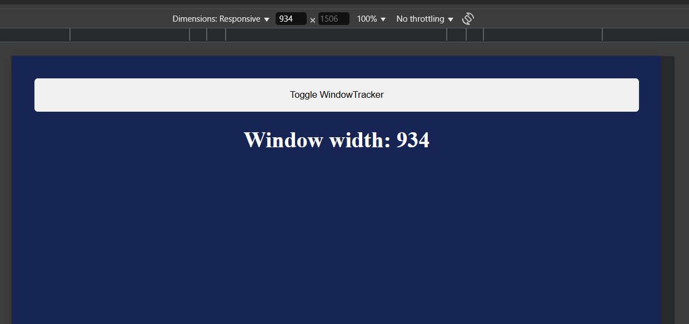

# React + Vite

This is a solution to the [Window Width challenge on Scrimba React course](https://scrimba.com/learn-react-c0e).

### Built with

- Semantic HTML5 markup
- CSS custom properties
- React

### Screenshot

### What I learned

- HTML and CSS Skills
- React Usage
- User Interface Design
- Debugging and Problem-Solving
- Code Organization
